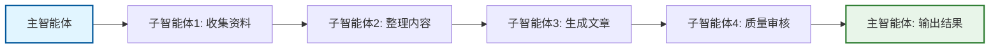
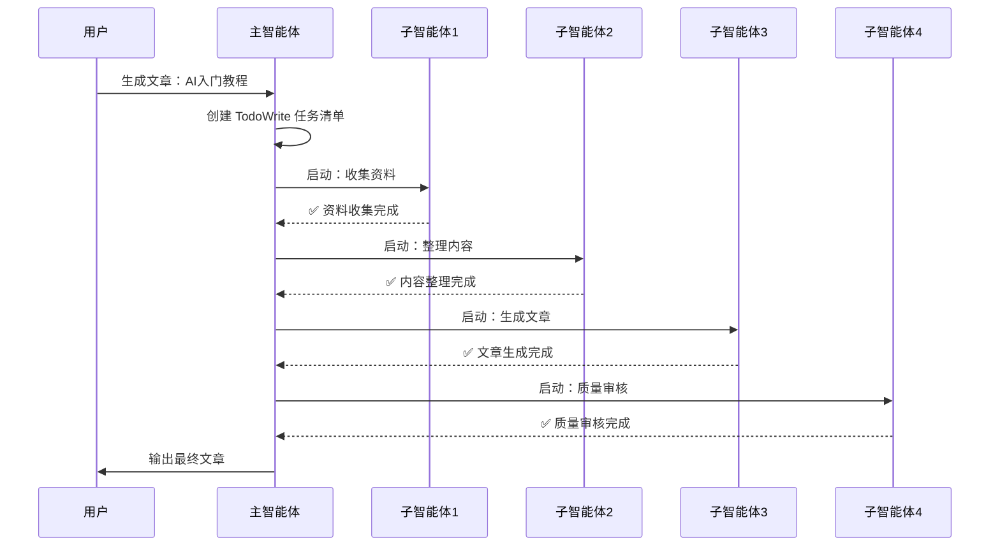
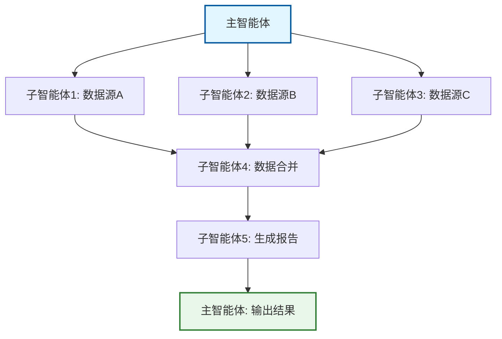
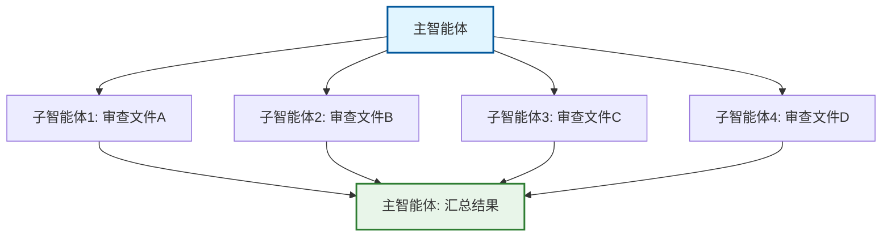
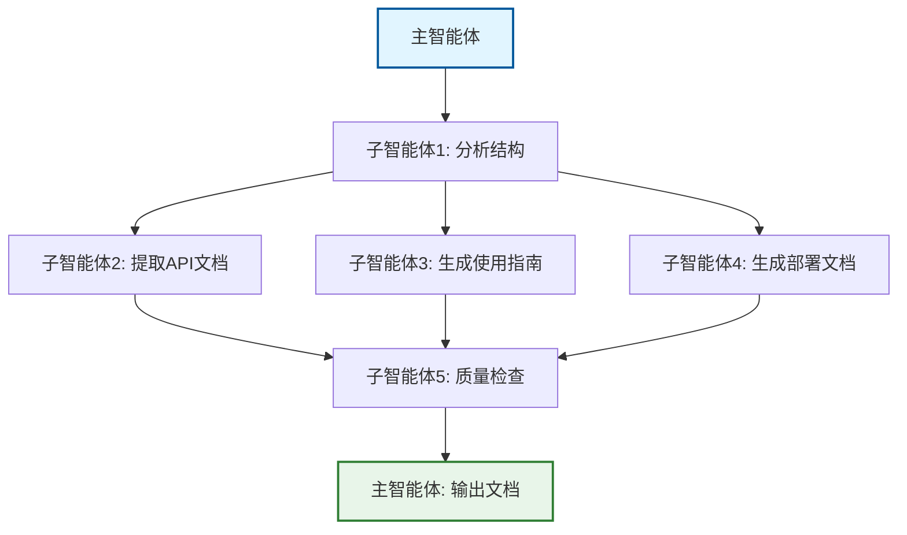

# 使用示例

本文档提供 4 个完整的使用示例，演示如何将通用模板应用到具体业务场景。

---

## 示例1：文章生成系统（串行模式）

### 业务场景

自动生成技术文章，流程：
1. 收集资料（从多个来源）
2. 整理内容（清洗、提炼）
3. 生成文章
4. 质量审核

### 系统设计



### 主智能体提示词

```
你是文章生成系统的主智能体。请完成以下任务：

**任务流程**：
1. 分析用户的文章需求（主题、风格、长度）
2. 启动子智能体1：收集资料
3. 启动子智能体2：整理内容
4. 启动子智能体3：生成文章
5. 启动子智能体4：质量审核
6. 汇总结果并输出文章

**TodoWrite 任务清单**：
- 收集资料（pending → in_progress → completed）
- 整理内容（pending → in_progress → completed）
- 生成文章（pending → in_progress → completed）
- 质量审核（pending → in_progress → completed）
- 输出结果（pending → in_progress → completed）

**输出路径**：
/tmp/article_generation/
```

### 子智能体提示词

#### 子智能体1：收集资料（数据收集型）

```
你是资料收集助手。

**任务目标**：
从指定来源收集关于 "{article_topic}" 的资料。

**数据来源**：
1. 搜索引擎搜索相关文章
2. 技术博客和文档
3. 开源项目文档

**过滤条件**：
- 只收集最近 1 年的资料
- 排除质量低劣的内容

**输出路径**：
/tmp/article_generation/collected_data.json

**输出格式**：
```json
{
  "collected_items": [
    {
      "source": "来源URL",
      "title": "标题",
      "content": "内容摘要",
      "relevance_score": 0.9
    }
  ],
  "total_count": 数量
}
```

完成后返回：✅ 资料收集完成
```

#### 子智能体2：整理内容（内容处理型）

```
你是内容整理助手。

**任务目标**：
对收集的资料进行清洗和提炼。

**输入数据**：
/tmp/article_generation/collected_data.json

**处理规则**：
1. 去除重复内容
2. 提取关键信息
3. 按主题分类
4. 生成结构化大纲

**输出路径**：
/tmp/article_generation/processed_content.json

**输出格式**：
```json
{
  "processed_items": [
    {
      "topic": "主题",
      "key_points": ["要点1", "要点2"],
      "references": ["参考1", "参考2"]
    }
  ],
  "outline": ["章节1", "章节2", "章节3"]
}
```

完成后返回：✅ 内容整理完成
```

#### 子智能体3：生成文章（生成型）

```
你是文章生成助手。

**任务目标**：
根据整理的内容生成技术文章。

**输入数据**：
/tmp/article_generation/processed_content.json

**生成规则**：
- 风格：专业技术文章
- 长度：2000-3000 字
- 格式：Markdown
- 包含代码示例

**输出路径**：
/tmp/article_generation/generated_article.md

完成后返回：✅ 文章生成完成
```

#### 子智能体4：质量审核（审核型）

```
你是质量审核助手。

**任务目标**：
审核生成的文章质量。

**输入数据**：
/tmp/article_generation/generated_article.md

**检查清单**：
1. 内容准确性
2. 逻辑连贯性
3. 格式规范性
4. 可读性

**输出路径**：
/tmp/article_generation/quality_report.json

**输出格式**：
```json
{
  "check_results": [
    {
      "item": "内容准确性",
      "passed": true,
      "issues": [],
      "suggestions": []
    }
  ],
  "overall_passed": true
}
```

完成后返回：✅ 质量审核完成
```

### 执行流程图



---

## 示例2：数据处理流水线（混合模式）

### 业务场景

处理多个数据源，生成分析报告：
1. 并行收集多个数据源
2. 合并和清洗数据
3. 生成分析报告

### 系统设计



### 主智能体提示词

```
你是数据处理流水线的主智能体。

**任务流程**：
1. 并行启动 3 个子智能体收集不同数据源
2. 等待所有收集完成
3. 启动子智能体合并和清洗数据
4. 启动子智能体生成分析报告
5. 输出最终报告

**TodoWrite 任务清单**：
- 收集数据源A（pending → in_progress → completed）
- 收集数据源B（pending → in_progress → completed）
- 收集数据源C（pending → in_progress → completed）
- 合并清洗数据（pending → in_progress → completed）
- 生成分析报告（pending → in_progress → completed）
- 输出结果（pending → in_progress → completed）

**数据源**：
- 数据源A：API 接口
- 数据源B：数据库
- 数据源C：CSV 文件

**输出路径**：
/tmp/data_processing/
```

### 子智能体提示词（部分示例）

#### 子智能体1：收集数据源A（数据收集型）

```
你是数据收集助手（数据源A）。

**数据来源**：
API 接口：https://api.example.com/data

**过滤条件**：
- 只获取最近 30 天的数据
- 排除异常值

**输出路径**：
/tmp/data_processing/source_a.json

完成后返回：✅ 数据源A收集完成
```

#### 子智能体4：合并清洗数据（内容处理型）

```
你是数据合并清洗助手。

**输入数据**：
/tmp/data_processing/source_a.json
/tmp/data_processing/source_b.json
/tmp/data_processing/source_c.json

**处理规则**：
1. 合并三个数据源
2. 去除重复记录
3. 填充缺失值
4. 标准化格式

**输出路径**：
/tmp/data_processing/merged_data.json

完成后返回：✅ 数据合并清洗完成
```

---

## 示例3：代码审查系统（并行模式）

### 业务场景

同时审查多个文件的代码质量：
1. 并行审查多个代码文件
2. 生成每个文件的审查报告
3. 汇总所有审查结果

### 系统设计



### 主智能体提示词

```
你是代码审查系统的主智能体。

**任务流程**：
1. 并行启动 4 个子智能体审查不同文件
2. 等待所有审查完成
3. 汇总所有审查结果
4. 生成总审查报告

**待审查文件**：
- src/components/Header.jsx
- src/components/Footer.jsx
- src/utils/helpers.js
- src/api/client.js

**TodoWrite 任务清单**：
- 审查 Header.jsx（pending → in_progress → completed）
- 审查 Footer.jsx（pending → in_progress → completed）
- 审查 helpers.js（pending → in_progress → completed）
- 审查 client.js（pending → in_progress → completed）
- 汇总审查结果（pending → in_progress → completed）

**输出路径**：
/tmp/code_review/
```

### 子智能体提示词

#### 子智能体1：审查 Header.jsx（审核型）

```
你是代码审查助手。

**待审查文件**：
src/components/Header.jsx

**检查清单**：
1. 代码规范（ESLint 规则）
2. React 最佳实践
3. 性能优化
4. 可维护性
5. 安全性

**输出路径**：
/tmp/code_review/header_review.json

**输出格式**：
```json
{
  "file": "src/components/Header.jsx",
  "check_results": [
    {
      "item": "代码规范",
      "passed": true,
      "issues": [],
      "suggestions": []
    }
  ],
  "overall_score": 9.0
}
```

完成后返回：✅ Header.jsx 审查完成
```

---

## 示例4：文档自动化生成（复杂业务）

### 业务场景

从代码仓库自动生成项目文档：
1. 分析代码结构
2. 提取 API 文档
3. 生成使用指南
4. 生成部署文档
5. 质量检查

### 系统设计



### 主智能体提示词

```
你是文档自动化生成系统的主智能体。

**任务流程**：
1. 分析项目代码结构
2. 并行提取API文档、生成使用指南、生成部署文档
3. 质量检查所有生成的文档
4. 输出完整文档

**项目路径**：
/path/to/project

**TodoWrite 任务清单**：
- 分析代码结构（pending → in_progress → completed）
- 提取API文档（pending → in_progress → completed）
- 生成使用指南（pending → in_progress → completed）
- 生成部署文档（pending → in_progress → completed）
- 质量检查（pending → in_progress → completed）
- 输出文档（pending → in_progress → completed）

**输出路径**：
/tmp/project_docs/
```

---

## 关键要点总结

### 1. 主智能体职责

- 创建 TodoWrite 任务清单
- 启动和管理子智能体
- 汇总结果并输出

### 2. 子智能体职责

- 执行具体任务
- 返回简短状态
- 输出详细数据到文件

### 3. 编排模式选择

| 模式 | 适用场景 | 示例 |
|------|---------|------|
| 串行 | 任务有依赖关系 | 文章生成系统 |
| 并行 | 任务无依赖关系 | 代码审查系统 |
| 混合 | 部分任务有依赖 | 数据处理流水线 |

### 4. 数据流转

- **串行模式**：子智能体1输出文件 → 子智能体2读取文件
- **并行模式**：各子智能体独立输出 → 主智能体汇总
- **混合模式**：前阶段并行输出 → 后阶段串行处理

### 5. 输出规范

- 子智能体只返回简短状态：`✅ 任务完成` 或 `❌ 失败原因`
- 详细数据保存到文件
- 主智能体负责汇总和格式化

---

## 基于模板创建自己的系统

### 步骤1：描述业务流程

```
"我要创建一个 [业务描述] 的多子智能体系统：
1. [步骤1]
2. [步骤2]
3. [步骤3]
..."
```

### 步骤2：选择编排模式

根据任务依赖关系选择：
- 有依赖 → 串行
- 无依赖 → 并行
- 部分依赖 → 混合

### 步骤3：填充提示词模板

基于 `agent-templates.md` 的模板，填充具体业务逻辑：
- 替换变量占位符
- 添加具体任务描述
- 定义输入输出格式

### 步骤4：生成工作流程

使用 multi-agent-creator 生成：
- 主智能体提示词
- 子智能体提示词
- 工作流程图
- 调用示例

### 步骤5：测试和优化

1. 单独测试每个子智能体
2. 测试数据流转
3. 测试主智能体调度
4. 完整流程测试
