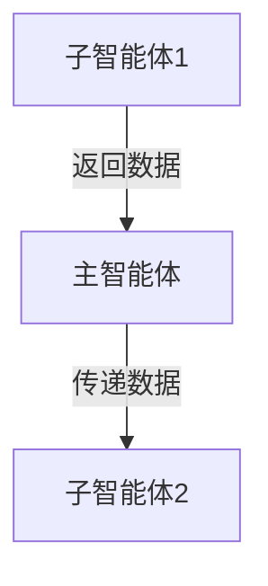

# 常见问题

本文档收集了使用 multi-agent-creator 时的常见问题及解答。

---

## 子智能体类型选择

**Q: 如何选择子智能体类型？**

A: 根据任务性质选择：

| 任务特征 | 推荐类型 |
|---------|---------|
| 需要获取数据 | 数据收集型 |
| 需要处理数据 | 内容处理型 |
| 需要执行操作 | 任务执行型 |
| 需要生成内容 | 生成型 |
| 需要检查质量 | 审核型 |

详细类型定义见 [agent-templates.md](agent-templates.md)

---

## 数据流转

**Q: 子智能体之间如何传递数据？**

A: 有两种方式：

### 方式1：通过文件流转（推荐）

**适用场景**：
- 数据量较大
- 需要持久化
- 多个子智能体共享数据

### 方式2：通过主智能体流转

**适用场景**：
- 数据量较小
- 不需要持久化
- 简单的串行流程

---

## 错误处理

**Q: 如何处理子智能体失败？**

A:
1. **记录失败原因**
2. **保留临时文件**（用于调试）
3. **决定是否重试**：
   - 临时错误（网络超时、文件锁定）：可重试
   - 逻辑错误（数据格式错误、业务逻辑冲突）：需要人工介入

详细错误处理机制见 [workflow.md](workflow.md)

---

## 子智能体数量

**Q: 可以创建多少个子智能体？**

A: 理论上无限制，但建议：

| 任务复杂度 | 推荐子智能体数量 |
|-----------|----------------|
| 简单任务 | 2-3 个 |
| 中等复杂度 | 3-5 个 |
| 复杂任务 | 5-10 个 |

**注意**：过多的子智能体会增加管理复杂度。

---

## 协作流程

**Q: 主智能体和子智能体如何协作？**

A:
1. 主智能体创建 TodoWrite 任务清单
2. 主智能体使用 Task 工具启动子智能体
3. 子智能体执行任务并返回简短状态
4. 主智能体收集结果并更新任务状态
5. 主智能体汇总结果并输出

详细协作流程见 [workflow.md](workflow.md)

---

## 测试方法

**Q: 如何测试生成的多智能体系统？**

A:
1. **单元测试**：单独测试每个子智能体
2. **集成测试**：测试子智能体之间的数据流转
3. **主智能体测试**：测试主智能体的任务管理逻辑
4. **完整流程测试**：端到端测试

---

## 性能优化

**Q: 如何优化多智能体系统的性能？**

A:
1. **优先使用并行模式**：如果任务之间无依赖
2. **控制子智能体数量**：不要创建过多的子智能体
3. **使用文件流转**：减少主智能体的数据传递开销
4. **合理设置超时**：避免子智能体长时间等待

---

## 技术栈

**Q: 子智能体必须使用 Python 吗？**

A: 不是。子智能体可以使用任何技术栈：
- Python
- Node.js
- Bash
- 其他语言

主智能体通过 Task 工具调用子智能体，不关心具体实现。

---

## 扩展性

**Q: 可以在现有系统上添加新的子智能体吗？**

A: 可以。步骤：
1. 分析新任务的职责和依赖关系
2. 选择合适的子智能体类型
3. 生成新的提示词模板
4. 更新主智能体的 TodoWrite 任务清单
5. 更新工作流程图

---

## 最佳实践

**Q: 有哪些最佳实践？**

A:
1. **单一职责**：每个子智能体只做一件事
2. **合理粒度**：任务不要太细或太粗
3. **输出规范**：子智能体只返回简短状态
4. **错误处理**：妥善处理失败情况
5. **文档化**：为每个子智能体编写清晰的文档

详细最佳实践见 [workflow.md](workflow.md)
