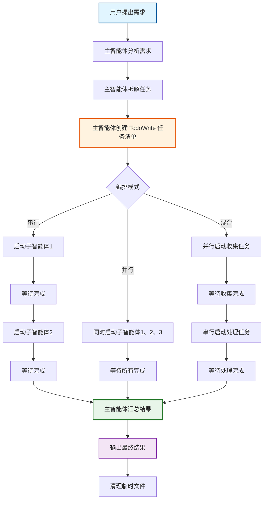
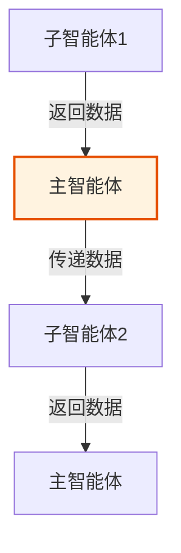

# 主子交互模式详解

本文档详细说明主子交互模式的完整工作流程，包括主智能体和子智能体的职责划分、TodoWrite 工具使用规范、Task 工具调用方式、以及错误处理机制。

---

## 工作流程概览



---

## 主智能体职责

### 1. 需求分析

分析用户描述的业务需求：
- 拆解关键步骤
- 识别任务依赖关系
- 确定子智能体类型和数量
- 选择编排模式

### 2. 任务管理

**必须使用 TodoWrite 工具**创建和追踪任务：

```python
# 第一步：创建任务清单
TodoWrite(
  todos = [
    {"content": "分析业务流程和需求", "status": "in_progress", "activeForm": "正在分析业务流程和需求"},
    {"content": "为任务A启动子智能体", "status": "pending", "activeForm": "正在为任务A启动子智能体"},
    {"content": "为任务B启动子智能体", "status": "pending", "activeForm": "正在为任务B启动子智能体"},
    # ... 根据实际任务数量动态创建
    {"content": "汇总结果并输出", "status": "pending", "activeForm": "正在汇总结果并输出"}
  ]
)
```

**重要规则**：
- 根据实际任务数量动态创建任务清单
- 每个子智能体对应一个任务
- 同时只能有一个任务处于 `in_progress` 状态
- 完成后立即标记为 `completed`

### 3. 子智能体调度

使用 Task 工具启动子智能体：

```python
# 串行调用示例
TodoWrite(todos=[...], current_task_index=1)  # "为任务A启动子智能体" → in_progress

Task(
  subagent_type="general-purpose",
  prompt="<子智能体任务提示>",
  description="执行任务A"
)

TodoWrite(todos=[...], current_task_index=1)  # "为任务A启动子智能体" → completed
```

```python
# 并行调用示例（在同一响应中多次调用）
TodoWrite(todos=[...], current_task_index=1)  # "为任务A启动子智能体" → in_progress
TodoWrite(todos=[...], current_task_index=2)  # "为任务B启动子智能体" → in_progress

Task(
  subagent_type="general-purpose",
  prompt="<子智能体1任务提示>",
  description="执行任务A"
)
Task(
  subagent_type="general-purpose",
  prompt="<子智能体2任务提示>",
  description="执行任务B"
)

# 等待完成后
TodoWrite(todos=[...], current_task_index=1)  # "为任务A启动子智能体" → completed
TodoWrite(todos=[...], current_task_index=2)  # "为任务B启动子智能体" → completed
```

### 4. 结果汇总

收集所有子智能体的返回结果：
- ✅ 成功：记录成功状态，收集输出数据
- ❌ 失败：记录失败原因，保留临时文件

### 5. 输出和清理

- 汇总所有子任务的结果
- 输出最终结果（文件、JSON、文本等）
- 清理临时文件（成功的删除，失败的保留）

---

## 子智能体职责

### 1. 任务执行

子智能体**专注执行具体任务**：
- 读取输入数据（文件或参数）
- 执行任务逻辑
- 生成输出数据

### 2. 输出规范

**重要**：子智能体**只返回简短状态**，不输出详细内容：

```python
# ✅ 正确的输出
"✅ 任务A完成"

# ❌ 错误的输出（太详细）
"✅ 任务A完成。处理了100条数据，发现了5个问题，修复了3个bug，耗时2.5秒..."
```

**失败时的输出**：
```python
# ✅ 正确的输出
"❌ 任务A失败：输入文件不存在"

# ❌ 错误的输出（太详细）
"❌ 任务A失败。原因是输入文件 /path/to/file.txt 不存在，请检查文件路径是否正确，确保文件存在..."
```

### 3. 数据输出

子智能体的输出数据应该：
- 保存到文件（JSON、文本等）
- 返回简短的文件路径或状态
- **不要**在响应中输出详细数据

---

## TodoWrite 工具详细规范

### 任务状态流转

```
pending → in_progress → completed
                 ↓
              failed
```

### 完整示例

假设有一个包含 3 个子智能体的系统：

```python
# 第一步：创建任务清单
TodoWrite(
  todos = [
    {"content": "分析业务流程和需求", "status": "in_progress", "activeForm": "正在分析业务流程和需求"},
    {"content": "为数据收集启动子智能体", "status": "pending", "activeForm": "正在为数据收集启动子智能体"},
    {"content": "为内容处理启动子智能体", "status": "pending", "activeForm": "正在为内容处理启动子智能体"},
    {"content": "为结果生成启动子智能体", "status": "pending", "activeForm": "正在为结果生成启动子智能体"},
    {"content": "汇总结果并输出", "status": "pending", "activeForm": "正在汇总结果并输出"}
  ]
)

# 第二步：分析完成后，标记第一个任务为 completed
TodoWrite(
  todos = [
    {"content": "分析业务流程和需求", "status": "completed", "activeForm": "正在分析业务流程和需求"},
    {"content": "为数据收集启动子智能体", "status": "in_progress", "activeForm": "正在为数据收集启动子智能体"},
    # ... 其他任务保持 pending
  ]
)

# 第三步：启动数据收集子智能体
Task(
  subagent_type="general-purpose",
  prompt="...",
  description="执行数据收集"
)

# 第四步：数据收集完成后
TodoWrite(
  todos = [
    # ...
    {"content": "为数据收集启动子智能体", "status": "completed", "activeForm": "正在为数据收集启动子智能体"},
    {"content": "为内容处理启动子智能体", "status": "in_progress", "activeForm": "正在为内容处理启动子智能体"},
    # ...
  ]
)

# 第五步：依此类推...
```

### 任务状态更新时机

| 时机 | 操作 |
|------|------|
| 创建任务清单 | 第一个任务标记为 `in_progress`，其他为 `pending` |
| 开始执行任务 | 将对应任务标记为 `in_progress` |
| 任务完成 | 将对应任务标记为 `completed` |
| 任务失败 | 将对应任务标记为 `failed`，可选记录错误原因 |

---

## Task 工具详细规范

### 基本调用

```python
Task(
  subagent_type="general-purpose",  # 子智能体类型
  prompt="任务提示词",               # 详细任务描述
  description="简短描述"            # 用于任务追踪
)
```

### 常用子智能体类型

| 子智能体类型 | 适用场景 |
|-------------|---------|
| `general-purpose` | 通用任务，搜索代码、执行多步骤任务 |
| `Explore` | 探索代码库，查找文件和模式 |
| `Bash` | 执行 Shell 命令 |

### 子智能体提示词模板

子智能体的提示词应该包含：

1. **角色定义**：子智能体是什么角色
2. **任务描述**：具体要做什么
3. **输入格式**：输入数据的格式和来源
4. **输出格式**：输出数据的格式和目标
5. **输出规范**：只返回简短状态
6. **错误处理**：失败时的处理方式

**示例模板**：

```
你是{角色名称}。请独立完成以下任务。

**任务目标**：
{任务描述}

**输入数据**：
- 来源：{数据来源}
- 格式：{数据格式}

**输出要求**：
- 保存到：{输出路径}
- 格式：{输出格式}

**重要提醒**：
- 只返回简短状态：✅ 任务完成 或 ❌ 任务失败：[原因]
- 不要输出详细的工作内容
```

---

## 数据流转方式

### 方式1：通过文件流转


**适用场景**：
- 数据量较大
- 需要持久化
- 多个子智能体共享数据

**示例**：

```python
# 子智能体1：收集数据
# 保存到：/tmp/data_collected.json
# 返回：✅ 数据收集完成

# 子智能体2：处理数据
# 读取：/tmp/data_collected.json
# 保存到：/tmp/data_processed.json
# 返回：✅ 数据处理完成

# 主智能体：汇总结果
# 读取：/tmp/data_processed.json
# 输出最终结果
```

### 方式2：通过主智能体流转



**适用场景**：
- 数据量较小
- 不需要持久化
- 简单的串行流程

**示例**：

```python
# 主智能体启动子智能体1
Task(
  subagent_type="general-purpose",
  prompt="收集数据并返回JSON格式的结果",
  description="收集数据"
)
# 子智能体1返回：{"data": [...]}

# 主智能体将数据传递给子智能体2
Task(
  subagent_type="general-purpose",
  prompt=f"处理以下数据：{子智能体1的返回数据}",
  description="处理数据"
)
```

---

## 错误处理和重试机制

### 子智能体失败处理

当子智能体失败时：

1. **记录失败原因**
2. **保留临时文件**（用于调试）
3. **决定是否重试**：
   - 临时错误（网络超时、文件锁定）：可重试
   - 逻辑错误（数据格式错误、业务逻辑冲突）：需要人工介入

### 重试策略

```python
# 简单重试示例
max_retries = 3
for attempt in range(max_retries):
    result = Task(...)
    if "成功" in result:
        break
    elif attempt < max_retries - 1:
        # 等待一段时间后重试
        time.sleep(2 ** attempt)  # 指数退避
```

### 错误信息格式

```python
# ✅ 正确的错误信息
"❌ 任务失败：输入文件不存在"
"❌ 任务失败：API调用超时"
"❌ 任务失败：数据格式错误"

# ❌ 错误的错误信息（太详细或包含技术细节）
"❌ 任务失败。错误码：E5001，堆栈：..."
```

---

## 最佳实践

### 1. 任务拆分原则

- 单一职责：每个子智能体只做一件事
- 合理粒度：任务不要太细（增加开销）或太粗（失去并行的意义）
- 识别依赖：明确任务之间的依赖关系

### 2. 编排模式选择

- **优先并行**：如果任务之间无依赖，优先使用并行模式
- **避免过度串行**：串行会降低整体效率
- **灵活混合**：根据实际需求组合使用

### 3. 输出控制

- 子智能体输出越简短越好
- 详细数据保存到文件
- 主智能体负责汇总和格式化

### 4. 临时文件管理

- 使用统一的临时目录
- 文件命名要有规律（如 `task_XX_output.json`）
- 成功后删除，失败后保留

### 5. 任务状态管理

- 及时更新任务状态
- 同时只有一个任务处于 `in_progress`
- 完成后立即标记为 `completed`

---

## 常见问题

**Q: 可以嵌套调用子智能体吗？**
A: 不建议。子智能体应该专注执行任务，不应该再调用其他子智能体。所有调度应该由主智能体完成。

**Q: 如何处理子智能体之间的数据共享？**
A: 通过文件系统。子智能体1输出到文件，子智能体2读取文件。

**Q: 并行调用子智能体有数量限制吗？**
A: 理论上没有，但建议不要同时启动太多（建议不超过10个），以免资源竞争。

**Q: 子智能体可以调用外部 API 吗？**
A: 可以，但要注意：
- 处理 API 超时和错误
- 遵守 API 限流规则
- 必要时使用重试机制

**Q: 如何调试失败的子智能体？**
A:
1. 查看子智能体返回的错误信息
2. 检查临时文件（如果有）
3. 单独运行子智能体进行调试
