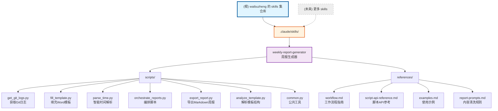

# waibuzheng 的 Skills 集合库

> 最后更新：2026-01-21 08:59:54

## 项目愿景

这是一个用于存放多个技能（skills）的集合仓库，每个 skill 都是一个独立的功能模块，可以被外部系统调用和复用。

**核心理念**：
- 每个 skill 都是独立的、可复用的功能单元
- 遵循 skill-creator 最佳实践
- 支持灵活的组合和扩展

## 架构总览

这是一个 monorepo 结构的 skills 集合库，每个 skill 都有独立的文档和实现。

**目录结构**：
```
waibuzheng-skills/
├── .claude/
│   ├── index.json                    # 项目索引配置
│   └── skills/                       # Skills 集合
      └── weekly-report-generator/  # 周报生成器
├── CLAUDE.md                         # 根级 AI 上下文（本文件）
└── README.md                         # 根级说明文档
```

**当前状态**：
- 已包含 1 个 skill：`weekly-report-generator`（周报生成器）
- 计划添加更多 skills

## 模块结构图



## 模块索引

| 模块路径 | 职责描述 | 语言 | 状态 | 文档 |
|---------|---------|------|------|------|
| `.claude/skills/weekly-report-generator` | 自动化周报生成器，从Git提交记录生成专业工作汇报。支持单周/多周批量生成、多项目汇总、自定义模板（Markdown/Word） | Python | 已实现 | [查看](./.claude/skills/weekly-report-generator/SKILL.md) |

## 如何添加新的 Skill

### 快速方法（推荐）

**直接告诉 Claude**：
```
使用 skill-creator 添加一个 "my-skill" 的 skill，功能是 [描述你的需求]
```

Claude 会自动：
1. 创建目录结构（在 `.claude/skills/my-skill/`）
2. 生成 SKILL.md, .claude/skills 下面不生成任何CLAUDE.md
3. 添加必要的脚本和模板
4. 更新根级文档

**重要约束**：
- ❌ **不要** 在 `.claude/skills/` 下创建 `CLAUDE.md` 和 `README.md` 文件
- ✅ 只创建 `SKILL.md` 和参考文档（如 `references/` 目录）

### Skill 完整结构（推荐）

```
.claude/skills/your-skill-name/
├── SKILL.md                 # 核心 instructions（必需）
├── requirements.txt         # 依赖清单（如需要）
├── scripts/                 # 核心脚本（如需要）
└── references/              # 参考文档（可选）
    ├── workflow.md          # 工作流程
    ├── api-reference.md     # API 参考
    └── examples.md          # 使用示例
```

## 运行与开发

### 环境要求

- Python 3.8+ （如果 skill 使用 Python）
- Node.js 20+ （如果 skill 使用 Node.js）

### 快速开始

1. **克隆仓库**
   ```bash
   git clone https://github.com/782042369/waibuzheng-skills.git
   cd waibuzheng-skills
   cp .claude/skills/weekly-report-generator ～/.claude/skills
   ```

   ```

2. **使用 skill**
   - 参考 skill 的 `SKILL.md` 文档
   - 按照 5 步工作流程使用


## AI 使用指引

### 适合 AI 辅助的任务

- 使用 skill-creator 添加新 skill
- 生成新 skill 的框架代码
- 优化和重构现有脚本
- 生成文档和示例
- 调试和问题排查

### 项目特定上下文

**这是一个 skills 集合库**：
- 每个 skill 都是独立的功能单元
- 可以被外部系统调用
- 支持灵活的组合使用

**关键概念**：
- **Skill**：一个独立的功能模块，如"周报生成器"
- **Monorepo**：多个 skills 共享一个仓库
- **可复用性**：skills 设计为可复用、可组合

**目录结构**：
- 每个 skill 只保留 `SKILL.md` 和必要的参考文档

**当 AI 需要修改或添加 skill 时**：
1. 先阅读 skill 的 `SKILL.md` 了解功能
2. 遵循 Skill 目录结构规范
3. 确保在 `.claude/skills/` 下不创建 `CLAUDE.md` 和 `README.md`
4. 确保添加必要的文档
